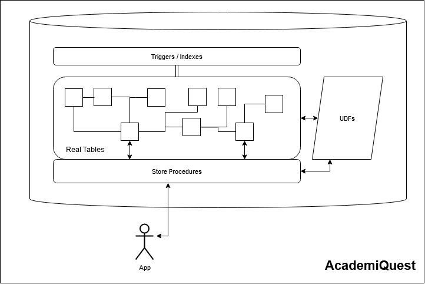
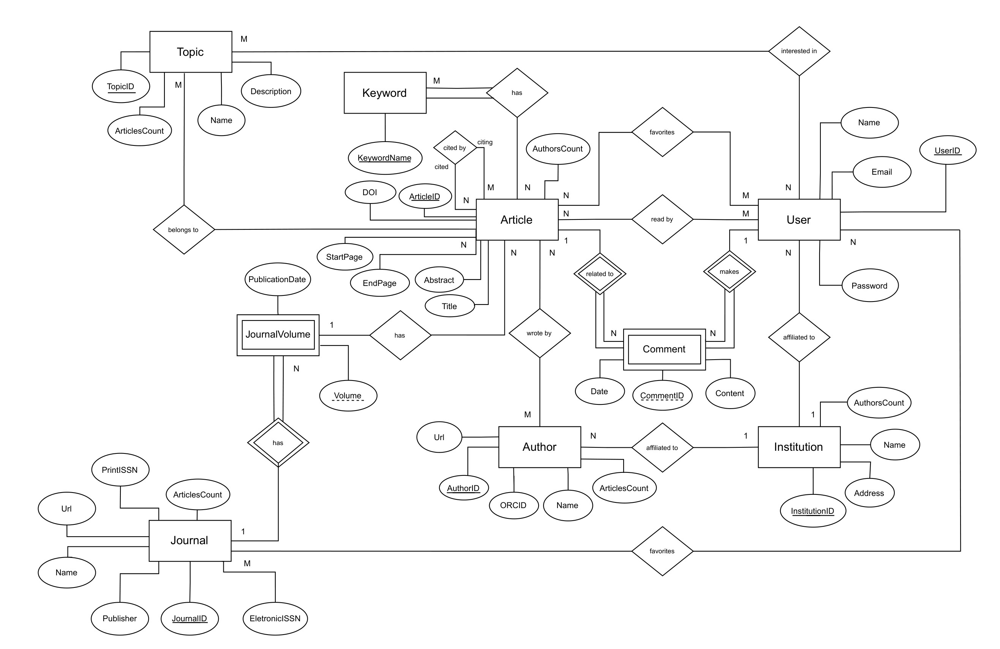
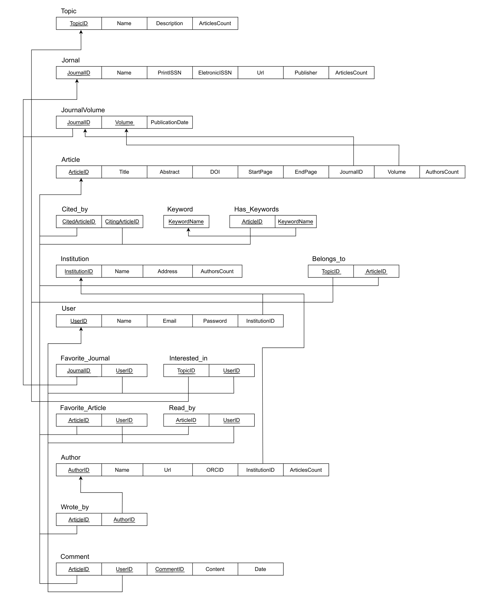
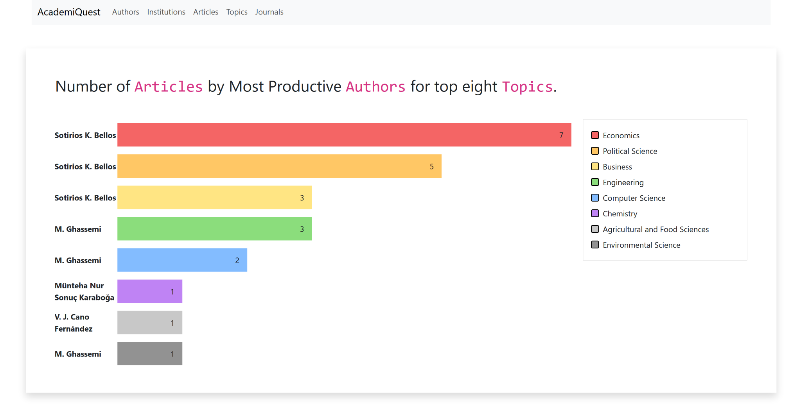
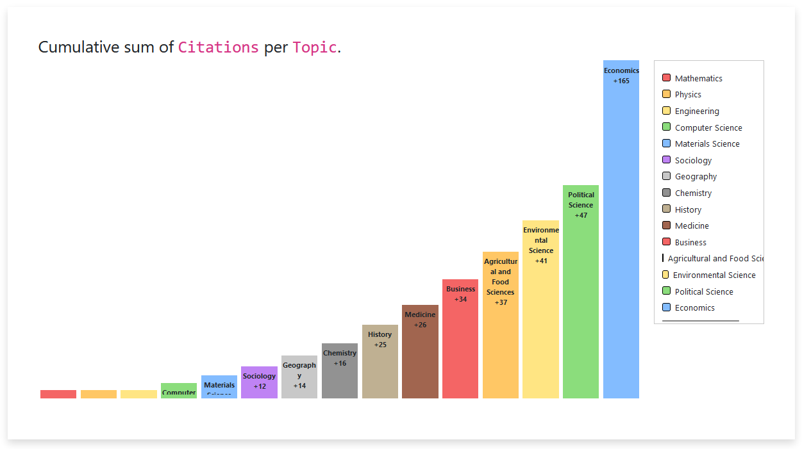

# BD: Trabalho Prático APF-T

**Grupo**: P5G1
- João Pinto, MEC: 104384
- Pedro Pinto, MEC: 115304

## Introdução / Introduction
 
Este trabalho consistiu no desenvolvimento de um sistema de gestão de artigos científicos. Para atingir esse objetivo, foi criada uma base de dados que armazena diversas entidades inter-relacionadas, tais como autores, instituições, artigos, tópicos e jornais. Um dos nossos principais objetivos foi utilizar dados reais para este trabalho, para tal recorremos à API Semantic Scholar. Devido ao uso de dados reais tivemos que fazer ligeiras alterações no DER e no ER, que serão explicadas posteriormente no relatório.

O sistema foi projetado para ser utilizado através de um website, onde os utilizadores interagem com a base de dados por meio de formulários. Estes formulários permitem operações como listar, ordenar, procurar, adicionar, ver detalhes, atualizar e eliminar registos de diferentes entidades. Além disso, são fornecidas estatísticas ao utilizador, como, por exemplo, os tópicos mais populares por ano ou os autores mais produtivos numa determinada área de investigação.

Este relatório documenta o desenvolvimento do sistema, apresentando a estrutura da base de dados e os elementos (Queries, SPs, UDFs, Triggers, Indexes, Cursors) criados. 


No planeamento deste sistema, optámos pela seguinte arquitetura: o cliente nunca contacta diretamente com as tabelas da nossa base de dados. Em vez disso, ele comunica com a base de dados através de Stored Procedures. Como podemos ver na seguinte arquitetura:



## ​Análise de Requisitos / Requirements

### Requisitos Funcionais
1. O sistema permite ao utilizador pesquisar artigos por título, autor e tópicos. É possível fazer uma pesquisa por diferentes critérios.
2. O sistema apresenta em cada artigo a informação disponível sobre o mesmo, como por exemplo, título, autores, jornal, abstract, data de publicação e número de citações. 
3. O sistema permite ao utilizador visualizar estatísticas sobre artigos científicos, jornais e tópicos.
4. O sistema permite ao gestor da base de dados adicionar, remover e editar artigos, autores, instituições, jornais e tópicos mantendo a consistência da base de dados.

### Requisitos Não Funcionais
1. O sistema é intuitivo e fácil de usar, sendo centrado na pesquisa de artigos.
2. O sistema é seguro, garantindo a confidencialidade dos dados do utilizador.
3. O sistema é eficiente, garantindo uma resposta rápida às pesquisas dos utilizadores. 

## DER - Diagrama Entidade Relacionamento/Entity Relationship Diagram

### Versão final/Final version



### APFE 

Para adaptar o nosso trabalho aos dados reais fornecidos pela API, fizemos as seguintes modificações no Diagrama Entidade-Relacionamento (DER):
- Na entidade "Journal" o atributo "Frequency" foi substituído pelo atributo "Url". 
- Na entidade "Author" o atributo "Email" foi substituído pelo atributo "Url".

Optámos por priorizar a eficiência nas consultas de procura e ordenação dos dados relativamente à inserção de dados. Para isso, criámos índices relacionados ao número de artigos e ao número de autores. Nas entidades "Author", "Journal" e "Topic" adicionámos o atributo "ArticlesCount". Nas entidades "Article" e "Institution", incluímos o atributo "AuthorsCount".

Além disso, devido às especificações dos dados fornecidos pela API, alterámos a relação "Belongs_to" entre "Topic" e "Journal" para uma nova relação entre "Topic" e "Article".

## ER - Esquema Relacional/Relational Schema

### Versão final/Final Version



### APFE

Pela mesma razão mencionada na secção do DER, o Esquema Relacional (ER) também sofreu ligeiras alterações:
- Na entidade "Journal" o atributo "Frequency" foi substituído pelo atributo "Url"; 
- Na entidade "Author" o atributo "Email" foi substituído pelo atributo "Url";
- Nas entidades "Author", "Journal" e "Topic" adicionámos o atributo "ArticlesCount" (índice);
- Nas entidades "Article" e "Institution", incluímos o atributo "AuthorsCount" (índice);
- Alterámos a relação "belongs to" entre "Topic" e "Journal" para uma nova relação entre "Topic" e "Article".

## ​SQL DDL - Data Definition Language

[SQL DDL File](sql/01_ddl.sql "SQLFileQuestion")

## SQL DML - Data Manipulation Language

A seguir, apresentamos as operações permitidas na tabela "Author" da base de dados, acessíveis através dos formulários disponíveis no website desenvolvido. Os store procedures apresentados encontram-se em `sql/02_sp_functions.sql` [[Aqui](sql/02_sp_functions.sql)].

Para facilitar a visualização, criámos a pasta `screenshots/author` [[Aqui](screenshots/author)] onde colocámos capturas de ecrã de cada uma dessas operações.

```sql
-- Listar os detalhes de um autor
EXEC ListAuthorDetails @AuthorID = ?;

-- Criar um novo autor
EXEC CreateAuthor @AuthorID = ?, @Name = ?, @Url = ?, @ORCID = ?, @InstitutionName = ?;

-- Listar autores por número de artigos publicados
EXEC OrderByArticlesCount;

-- Listar autores por ordem alfabética
EXEC OrderByAuthorName;

-- Filtrar autores com base num determinado nome
EXEC OrderBySearchAuthorName @AuthorName = ?;

-- Eliminar um autor
EXEC DeleteAuthor @AuthorID = ?;

-- Editar a informação de um autor
EXEC UpdateAuthor @AuthorID = ?, @Name = ?, @Url = ?, @ORCID = ?, @InstitutionName = ?;
```

A seguir, apresentamos as operações permitidas na tabela "Institution" da base de dados, acessíveis através dos formulários disponíveis no website desenvolvido. Os store procedures apresentados encontram-se em `sql/02_sp_functions.sql` [[Aqui](sql/02_sp_functions.sql)].

Para facilitar a visualização, criámos a pasta `screenshots/institution` [[Aqui](screenshots/institution)] onde colocámos capturas de ecrã de cada uma dessas operações.

```sql
-- Listar os detalhes de uma instituição
EXEC ListInstitutionDetails @InstitutionID = ?;

-- Criar uma nova instituição
EXEC CreateInstitution @InstitutionID = ?, @Name = ?, @Address = ?;

-- Listar instituições por número de autores
EXEC OrderByAuthorsCount;

-- Listar instituições por ordem alfabética
EXEC OrderByInstitutionName;

-- Filtrar instituições com base num determinado nome
EXEC OrderBySearchInstitutionName @InstitutionName = ?;

-- Eliminar uma instituição
EXEC DeleteInstitution @InstitutionID = ?;

-- Editar a informação de uma instituição
EXEC UpdateInstitution @InstitutionID = ?, @Name = ?, @Address = ?;
```

A seguir, apresentamos as operações permitidas na tabela "Article" da base de dados, acessíveis através dos formulários disponíveis no website desenvolvido. Os store procedures apresentados encontram-se em `sql/02_sp_functions.sql` [[Aqui](sql/02_sp_functions.sql)].

Para facilitar a visualização, criámos a pasta `screenshots/article` [[Aqui](screenshots/article)] onde colocámos capturas de ecrã de cada uma dessas operações.

```sql
-- Listar os detalhes de um artigo
EXEC ListArticleDetails @ArticleID = ?;

-- Criar um novo artigo
EXEC CreateArticle @ArticleID = ?, @Title = ?, @Abstract = ?, @DOI = ?, @StartPage = ?, @EndPage = ?, @JournalName = ?, @Volume = ?;

-- Listar artigos por número de autores
EXEC OrderByAuthorsCount_article;

-- Listar artigos por ordem alfabética
EXEC OrderByArticleTitle;

-- Filtrar artigos com base num determinado título
EXEC OrderBySearchArticleTitle @ArticleTitle = ?;

-- Eliminar um artigo
EXEC DeleteArticle @ArticleID = ?;

-- Editar a informação de um artigo
EXEC UpdateArticle @ArticleID = ?, @Title = ?, @Abstract = ?, @DOI = ?, @StartPage = ?, @EndPage = ?, @JournalName = ?, @Volume = ?;
```

A seguir, apresentamos as operações permitidas na tabela "Topic" da base de dados, acessíveis através dos formulários disponíveis no website desenvolvido. Os store procedures apresentados encontram-se em `sql/02_sp_functions.sql` [[Aqui](sql/02_sp_functions.sql)].

Para facilitar a visualização, criámos a pasta `screenshots/topic` [[Aqui](screenshots/topic)] onde colocámos capturas de ecrã de cada uma dessas operações.

```sql
-- Listar os detalhes de um tópico
EXEC ListTopicDetails @TopicID = ?;

-- Criar um novo tópico
EXEC CreateTopic @TopicID = ?, @Name = ?, @Description = ?;

-- Listar tópicos por número de artigos
EXEC OrderByArticlesCount_topic;

-- Listar tópicos por ordem alfabética
EXEC OrderByTopicName;

-- Filtrar tópicos com base num determinado nome
EXEC OrderBySearchTopicName @TopicName = ?;

-- Eliminar um tópico
EXEC DeleteTopic @TopicID = ?;

-- Editar a informação de um tópico
EXEC UpdateTopic @TopicID = ?, @Name = ?, @Description = ?;
```

A seguir, apresentamos as operações permitidas na tabela "Journal" da base de dados, acessíveis através dos formulários disponíveis no website desenvolvido. Os store procedures apresentados encontram-se em `sql/02_sp_functions.sql` [[Aqui](sql/02_sp_functions.sql)].

Para facilitar a visualização, criámos a pasta `screenshots/journal` [[Aqui](screenshots/journal)] onde colocámos capturas de ecrã de cada uma dessas operações.

```sql
-- Listar os detalhes de um jornal
EXEC ListJournalDetails @JournalID = ?;

-- Criar um novo jornal
EXEC CreateJournal @JournalID = ?, @Name = ?, @PrintISSN = ?, @EletronicISSN = ?, @Url = ?, @Publisher = ?;

-- Listar jornais por número de artigos
EXEC OrderByArticlesCount_journal;

-- Listar jornais por ordem alfabética
EXEC OrderByJournalName;

-- Filtrar jornais com base num determinado nome
EXEC OrderBySearchJournalName @JournalName = ?;

-- Eliminar um jornal
EXEC DeleteJournal @JournalID = ?;

-- Editar a informação de um jornal
EXEC UpdateJournal @JournalID = ?, @Name = ?, @PrintISSN = ?, @EletronicISSN = ?, @Url = ?, @Publisher = ?;
```

Além disso, são fornecidas estatísticas ao utilizador, usando as seguintes operações presentes em `sql/02_sp_functions.sql` [[Aqui](sql/02_sp_functions.sql)].

```sql
--- Autores mais produtivos numa determinada área de investigação
EXEC MostProductiveAuthorsByTopic;

--- Tópicos mais populares por ano
EXEC Top3TopicsPerYear;

--- Soma acumulativa de citações por tópico
EXEC RunningCitationsSumPerTopic;
```





## Normalização/Normalization

Para minimizar a duplicação de dados na nossa base de dados, adotámos uma série de passos na estruturação das tabelas.

Primeiramente, na tabela "Article", evitámos a duplicação de dados não incluindo atributos como "PublicationDate" e "TopicName" diretamente. Em vez disso, criámos as tabelas "JournalVolume" e "Topic" para armazenar essas informações que são comuns a vários artigos. Este passo previne a necessidade de múltiplos updates e problemas de consistência entre cópias da mesma informação. Utilizámos uma chave estrangeira composta (JournalID, Volume) para manter a dependência correta com "JournalVolume". Para garantir uma associação eficiente entre tópicos e artigos, críamos a tabela "Belongs_to" com uma chave primária composta por (TopicID, ArticleID). É de salientar que a informação comum a múltiplos volumes de um mesmo jornal é mantida na tabela "Journal". Ainda relativamente à tabela "Article" para evitar incluir a informação de todos os artigos que citaram uma publicação, criámos a tabela "Cited_by" com uma chave primária composta (CitedArticleID, CitingArticleID), mantendo a informação de citações organizada e evitando duplicações.

Além disso, para evitar que um artigo tivesse uma lista de todos os seus autores, o que violaria a 1NF, criámos a tabela "Wrote_by" com uma chave primária composta (ArticleID, AuthorID), assegurando que cada associação entre artigos e autores é única. Utilizámos a mesma abordagem para as relações "Has_keywords", "Favorite_Journal", "Interested_in", "Favorite_Article" e "Read_by", criando tabelas associativas que mantêm a integridade e unicidade das relações entre entidades. Na tabela "Author" optámos por não incluir o nome da instituição a que o autor pertence. A dependência com "Institution" é mantida através da chave estrangeira "InstitutionID". 

**Em relação à normalização**, garantimos que todas as tabelas tivessem valores atómicos e que não existissem relações dentro de relações (1NF). Eliminámos dependências parciais, assegurando que cada atributo não-chave fosse totalmente dependente da chave primária (2NF). Também eliminámos dependências transitivas de atributos não-chave, como exemplificado pela tabela "Institution", onde não há quaisquer atributos dependentes de "Author", o que se aplica igualmente às restantes tabelas (3NF).

A **BCNF** exige que todos os atributos sejam funcionalmente dependentes da chave da relação, de toda a chave e nada mais. Isto verifica-se nas nossas tabelas. Por exemplo, na tabela "Journal" onde temos a chave primária "JournalID" temos a seguinte dependência: JournalID -> Name, PrintISSN, EletronicISSN, Url, Publisher, ArticlesCount.

Uma relação está na 4NF se estiver na BCNF e não existirem dependências multivalor. Analisando as tabelas, constatamos que não está nesta forma. Conseguiríamos alcançar esta forma normal reduzindo a redundância na nossa base de dados à custa da introdução de novas relações. Por exemplo, poderíamos separar [Article.Title, Article.StartPage] e [Article.Title, Article.EndPage]. 

A 5NF, trata de dependências de junção. Uma vez que não está na 4FN, pela definição da 5FN não se encontra nesta forma.

## Índices/Indexes

Os índices foram criados para melhorar a performance das consultas. Optámos por priorizar a eficiência na procura e ordenação dos dados, em detrimento da inserção de grandes volumes de dados, pois as operações de leitura são mais comuns no uso diário desta base de dados. Para isso, criámos índices focados em atributos-chave como nomes, número de artigos e número de autores.

Por exemplo, nas tabelas "Author", "Institution", "Topic", "Journal" e "Article", foram criados índices associados ao atributo "Name". Esses índices facilitam a procura, melhorando a eficiência das consultas que envolvem ordenação ou filtragem por nome.

Adicionalmente, nas tabelas "Author", "Journal" e "Topic", criámos índices na coluna "ArticlesCount" para otimizar as consultas que envolvem a contagem de artigos. De maneira similar, nas tabelas "Article" e "Institution", foram criados índices na coluna "AuthorsCount" para melhorar a eficiência das consultas relacionadas à contagem de autores.

Esses índices são especialmente úteis quando os utilizadores do website ordenam resultados com base na quantidade de artigos ou autores, proporcionando uma experiência de procura mais rápida e eficiente, como verificámos no Execution Plan do SQL Server apresentado no `slides.pdf` [[Aqui](slides.pdf)].


```sql
-- Indíces da tabela Author
CREATE NONCLUSTERED INDEX IDX_Author_Name
ON Author ([Name]);

CREATE NONCLUSTERED INDEX IDX_Author_ArticlesCount
ON Author (ArticlesCount);

-- Indíces da tabela Institution
CREATE NONCLUSTERED INDEX IDX_Institution_Name
ON Institution ([Name]);

CREATE NONCLUSTERED INDEX IDX_Institution_AuthorsCount
ON Institution (AuthorsCount);

-- Indíces da tabela Topic
CREATE NONCLUSTERED INDEX IDX_Topic_Name
ON Topic ([Name]);

CREATE NONCLUSTERED INDEX IDX_Topic_ArticlesCount
ON Topic (ArticlesCount);

-- Indíces da tabela Journal
CREATE NONCLUSTERED INDEX IDX_Journal_Name
ON Journal ([Name]);

CREATE NONCLUSTERED INDEX IDX_Journal_ArticlesCount
ON Journal (ArticlesCount);

-- Indíces da tabela Article 
CREATE NONCLUSTERED INDEX IDX_Article_Title
ON Article ([Title]);

CREATE NONCLUSTERED INDEX IDX_Article_AuthorsCount
ON Article (AuthorsCount);
```

## SQL Programming: Stored Procedures, Triggers, UDF, Indexes

[SQL SPs and Functions File](sql/02_sp_functions.sql "SQLFileQuestion")

[SQL Triggers File](sql/03_triggers.sql "SQLFileQuestion")

[SQL Tables and Indexes File](sql/01_ddl.sql "SQLFileQuestion")


### Apresentação

[Slides](slides.pdf "Slides")

[Video](https://uapt33090-my.sharepoint.com/:v:/g/personal/pmap_ua_pt/Ea9V8s1UJJ1Eu1CkkE0fqqsBSCo6UPM4WTdhw9kTfZGvIg?nav=eyJyZWZlcnJhbEluZm8iOnsicmVmZXJyYWxBcHAiOiJPbmVEcml2ZUZvckJ1c2luZXNzIiwicmVmZXJyYWxBcHBQbGF0Zm9ybSI6IldlYiIsInJlZmVycmFsTW9kZSI6InZpZXciLCJyZWZlcnJhbFZpZXciOiJNeUZpbGVzTGlua0NvcHkifX0&e=dqXb9q)
